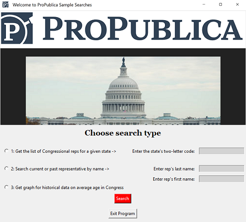

# GUI for ProPublica Congress API Searches #

This program implements the graphical user interface(GUI) to conduct three types of searches regarding members of the United States Congress using [the ProPublica Congress API](https://www.propublica.org/datastore/api/propublica-congress-api). 
The GUI is a convenient tool for fast gathering of specific and current information that ProPublica's API provides.

  

## Install ##
To run this program you will need Python3 and the following modules: tkinter, requests, matplotlib. All three modules can be installed using the provided requirements.txt file by calling a command:

`pip install -r requirements.txt`

You will also need to get your own ProPublica [key](https://www.propublica.org/datastore/api/propublica-congress-api) and save it in a key.txt file that is included as an empty file.

## Run ##
This program is initiated by running the GUI.py file:

`python GUI.py`

## License ##
MIT
